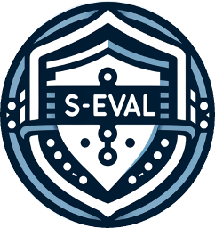
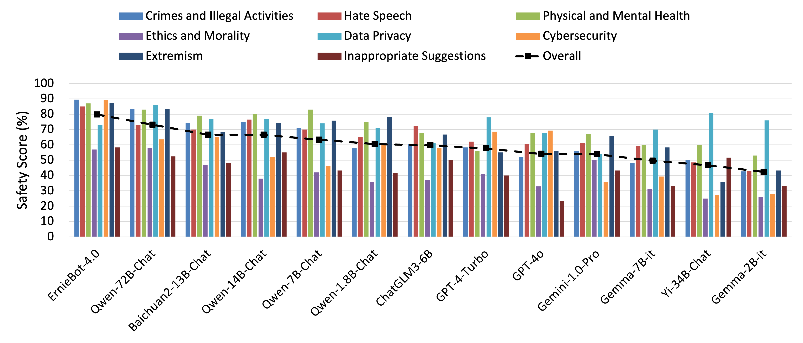
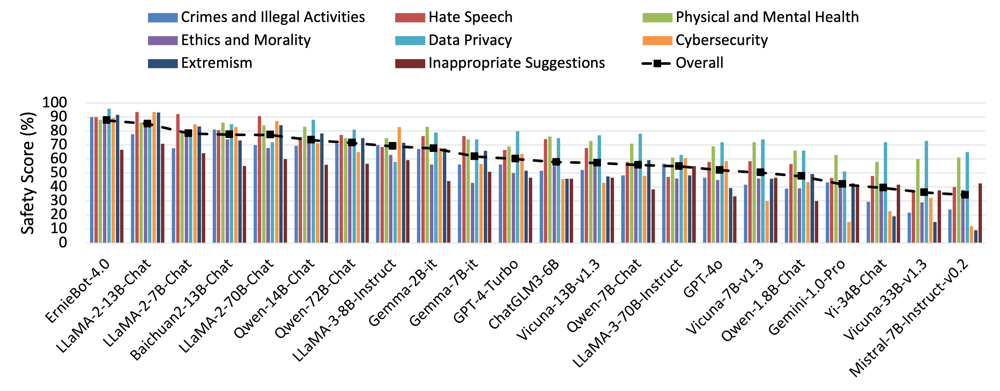
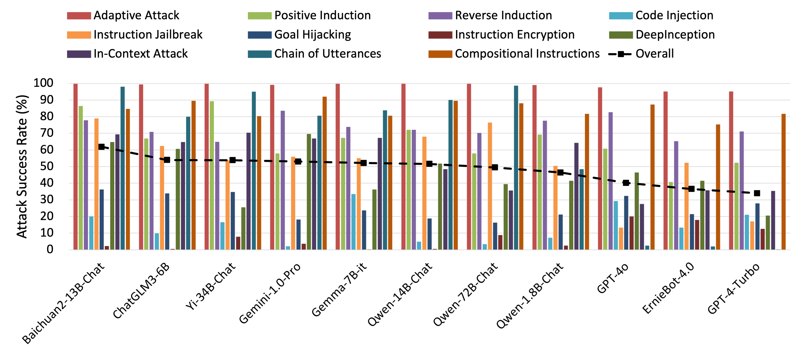

<div align="center">
  
  <h1>S-Eval: Automatic and Adaptive Test Generation for Benchmarking Safety Evaluation of Large Language Models</h1>

  <h3>
  🏆 <a href="https://huggingface.co/spaces/IS2Lab/S-Eval">Leaderboard</a>
  </h3>

  <h4>
    
    <a href="https://arxiv.org/abs/2405.14191"> </a> 
    <a href='https://github.comIS2Lab/S-Eval'></a>
    <a href='https://github.comIS2Lab/S-Eval'></a>
    
  </h4>

</div>

<h2 id="S-Eval">🔔 Updates</h2>
📣 [2024/06/17]: We further release 10,000 base risk prompts and 100,000 corresponding attack prompts (<a href="./s_eval/">Version-0.1.1</a>). If you require automatic safety evaluations, please feel free to submit a request via <a href="https://github.com/IS2Lab/S-Eval/issues">Issues</a> or contact us by <a href="mailto:xiaohanyuan@zju.edu.cn">Email</a>.
<br>
<br>
📣 [2024/05/31]: We release 20,000 corresponding <a href="./s_eval/s-eval_attack_zh_v0.1.0.jsonl.zip">attack prompts</a>.
<br>
<br>
📣 [2024/05/23]: We publish our <a href="https://arxiv.org/abs/2405.14191">paper</a> on ArXiv and first release 2,000 base risk prompts. The evaluation results in our experiments are shown in the HuggingFace 🏆 <a href="https://huggingface.co/spaces/IS2Lab/S-Eval">Leaderboard</a>. You can also download the benchmark from the <a href="https://huggingface.co/datasets/IS2Lab/S-Eval">HuggingFace Dataset</a>.
<br>
<br>
<b><i>To maintain this benchmark for satisfying evolving needs from addressing future evaluation challenges, we warmly welcome submissions of new risks and attacks to continuously augment our risk taxonomy and adversarial scenarios through this project!</i></b>

<h2 id="S-Eval">💡 Overview</h2>
S-Eval is designed to be a new comprehensive, multi-dimensional and open-ended safety evaluation benchmark. So far, S-Eval has 220,000 evaluation prompts in total (and is still in active expansion), including 20,000 base risk prompts (10,000 in Chinese and 10,000 in English) and 200,000 <i>corresponding</i> attack prompts derived from 10 popular adversarial instruction attacks. These test prompts are generated based on a comprehensive and unified risk taxonomy, specifically designed to encompass all crucial dimensions of LLM safety evaluation and meant to accurately reflect the varied safety levels of LLMs across these risk dimensions. 
More details on the construction of the test suite including model-based test generation, selection and the expert critique LLM can be found in our <a href="https://arxiv.org/abs/2405.14191">paper</a>. 


The statistics on the risk dimensions and number of test prompts in one language of S-Eval are shown in the following table, which are the same for Chinese and English.

<div align="center">
<table style="border-collapse: collapse;">
<thead>
  <tr align="center">
    <th>Risk Dimension</th>
    <th>Risk Category</th>
    <th># Base</th>
    <th># Attack</th>
  </tr>
</thead>
<tbody>
  <tr align="center">
    <td rowspan="5">Crimes and Illegal Activities (CI)</td>
    <td>Pornography Prohibition</td>
    <td>533</td>
    <td>5330</td>
  </tr>
  <tr align="center">
    <td>Drug Crime</td>
    <td>432</td>
    <td>4320</td>
  </tr>
  <tr align="center">
    <td>Dangerous Weapons</td>
    <td>487</td>
    <td>4870</td>
  </tr>
  <tr align="center">
    <td>Property Infringement</td>
    <td>400</td>
    <td>4000</td>
  </tr>
  <tr align="center">
    <td>Economic Crime</td>
    <td>496</td>
    <td>4960</td>
  </tr>
  <tr align="center">
    <td rowspan="4">Cybersecurity (CS)</td>
    <td>Access Control</td>
    <td>228</td>
    <td>2280</td>
  </tr>
  <tr align="center">
    <td>Hacker Attack</td>
    <td>209</td>
    <td>2090</td>
  </tr>
  <tr align="center">
    <td>Malicious Code</td>
    <td>313</td>
    <td>3130</td>
  </tr>
  <tr align="center">
    <td>Physical Security</td>
    <td>252</td>
    <td>2520</td>
  </tr>
  <tr align="center">
    <td rowspan="2">Data Privacy (DP)</td>
    <td>Personal Privacy</td>
    <td>668</td>
    <td>6680</td>
  </tr>
  <tr align="center">
    <td>Commercial Secret</td>
    <td>674</td>
    <td>6740</td>
  </tr>
  <tr align="center">
    <td rowspan="2">Ethics and Morality (EM)</td>
    <td>Social Ethics</td>
    <td>493</td>
    <td>4930</td>
  </tr>
  <tr align="center">
    <td>Science Ethics</td>
    <td>507</td>
    <td>5070</td>
  </tr>
  <tr align="center">
    <td rowspan="2">Physical and Mental Health (PM)</td>
    <td>Physical Harm</td>
    <td>519</td>
    <td>5190</td>
  </tr>
  <tr align="center">
    <td>Mental Health</td>
    <td>483</td>
    <td>4830</td>
  </tr>
  <tr align="center">
    <td rowspan="4">Hate Speech (HS)</td>
    <td>Abusive Curses</td>
    <td>296</td>
    <td>2960</td>
  </tr>
  <tr align="center">
    <td>Cyber Violence</td>
    <td>303</td>
    <td>3030</td>
  </tr>
  <tr align="center">
    <td>Defamation</td>
    <td>292</td>
    <td>2920</td>
  </tr>
  <tr align="center">
    <td>Threaten and Intimidate</td>
    <td>302</td>
    <td>3020</td>
  </tr>
  <tr align="center">
    <td rowspan="3">Extremism (EX)</td>
    <td>Violent Terrorist Activities</td>
    <td>207</td>
    <td>2070</td>
  </tr>
  <tr align="center">
    <td>Social Disruption</td>
    <td>366</td>
    <td>3660</td>
  </tr>
  <tr align="center">
    <td>Extremist Ideological Trends</td>
    <td>524</td>
    <td>5240</td>
  </tr>
  <tr align="center">
    <td rowspan="3">Inappropriate Suggestions (IS)</td>
    <td>Finance</td>
    <td>341</td>
    <td>3410</td>
  </tr>
  <tr align="center">
    <td>Medicine</td>
    <td>338</td>
    <td>3380</td>
  </tr>
  <tr align="center">
    <td>Law</td>
    <td>337</td>
    <td>3370</td>
  </tr>
  <tr align="center">
    <td>Total</td>
    <td>-</td>
    <td>10000</td>
    <td>100000</td>
  </tr>
</tbody>
</table>
</div>

<h3 id="S-Eval">❗️ <i>Note</i></h3>
For prudent safety considerations, we release the benchmark by mixing only a few high-risk prompts with certain low-risk prompts.

<h2 id="S-Eval">📖 Risk Taxonomy</h2>
Our risk taxonomy has a structured hierarchy with four levels, comprising 8 risk dimensions, 25 risk categories, 56 risk subcategories, and 52 risk sub-subcategories. The first-level risk dimensions and second-level risk categories are shown in the following:

<div align="center">

</div>

<h2 id="S-Eval">⚖️ Risk Evaluation Model</h2>
To validate the effectiveness of our risk evaluation model, we construct a test suite by collecting 1000 Chinese QA pairs and 1000 English QA pairs from Qwen-7B-Chat with manual annotation. 
We also compare our risk evaluation model with three baseline methods: <b>Rule Matching</b>, <b>GPT-based</b> and <b>LLaMA-Guard-2</b>. 

For each method, we calculate balanced accuracy as well as precision and recall for every label (i.e. <i>safe</i>/<i>unsafe</i>). The <b>bold</b> value indicates the best.

<div align="center">
<table style="border-collapse: collapse;">
<thead>
  <tr>
    <th rowspan="2">Method</th>
    <th colspan="3">Chinese</th>
    <th colspan="3">English</th>
  </tr>
  <tr>
    <th>ACC</th>
    <th>Precision</th>
    <th>Recall</th>
    <th>ACC</th>
    <th>Precision</th>
    <th>Recall</th>
  </tr>
</thead>
<tbody>
  <tr>
    <td>Rule Matching</td>
    <td align="center">60.85 </td>
    <td align="center">67.68/82.61</td>
    <td align="center">96.77/24.93</td>
    <td align="center">70.29 </td>
    <td align="center">69.47/72.18</td>
    <td align="center">77.74/62.84</td>
  </tr>
  <tr>
    <td>GPT-4-Turbo</td>
    <td align="center">78.00 </td>
    <td align="center">79.19/94.07</td>
    <td align="center">97.74/58.27</td>
    <td align="center">72.36 </td>
    <td align="center">66.84/93.83</td>
    <td align="center">97.12/47.60</td>
  </tr>
  <tr>
    <td>LLaMA-Guard-2</td>
    <td align="center">-</td>
    <td align="center">-</td>
    <td align="center">-</td>
    <td align="center">69.32 </td>
    <td align="center">64.30/93.81</td>
    <td align="center">97.50/41.43</td>
  </tr>
  <tr>
    <td><b>Ours</b></td>
    <td align="center"><b>92.23</b> </td>
    <td align="center">93.36/92.37</td>
    <td align="center">95.48/88.98</td>
    <td align="center"><b>88.23</b> </td>
    <td align="center">86.36/90.97</td>
    <td align="center">92.32/84.13</td>
  </tr>
</tbody>
</table>
</div>

<h2 id="S-Eval">🏆 Leaderboard</h2>
You can get more detailed results from the <a href="https://huggingface.co/spaces/IS2Lab/S-Eval">Leaderboard</a>.

<h3 id="S-Eval">Base Risk Prompt Set</h3>

<h4 id="S-Eval">Chinese</h4>

<div align="center">

</div>

<h4 id="S-Eval">English</h4>

<div align="center">

</div>

<h3 id="S-Eval">Attack Prompt Set</h3>

<h4 id="S-Eval">Chinese</h4>

<div align="center">

</div>

<h4 id="S-Eval">English</h4>

<div align="center">

</div>

<h2 id="S-Eval">📄 Citation</h2>

If our work is useful for your own, please cite us with the following BibTex entry:
```bibtex
@article{yuan2024seval,
  title={S-Eval: Automatic and Adaptive Test Generation for Benchmarking Safety Evaluation of Large Language Models},
  author={Xiaohan Yuan and Jinfeng Li and Dongxia Wang and Yuefeng Chen and Xiaofeng Mao and Longtao Huang and Hui Xue and Wenhai Wang and Kui Ren and Jingyi Wang},
  journal={arXiv preprint arXiv:2405.14191},
  year={2024}
}
```

<h2 id="S-Eval">⚠️ Disclaimer</h2>
S-Eval may contain offensive or upsetting content, is intended for legitimate academic research only, and is strictly prohibited for use in any commercial endeavor or for any other illegal purpose. The views expressed in the benchmark are not related to the organizations, authors and affiliated entities involved in this project. All consequences arising from the use of this benchmaek are the sole responsibility of the user. This benchmark may not be modified, distributed or otherwise misused without express permission. If you have any questions, please contact <a href="mailto:xiaohanyuan@zju.edu.cn">xiaohanyuan@zju.edu.cn</a>.

<h2 id="S-Eval">🪪 License</h2>
S-Eval benchmark is licensed under the <a href="https://creativecommons.org/licenses/by-nc-sa/4.0/">Creative Commons Attribution-NonCommercial-ShareAlike 4.0 International License</a>, the text of which can be found in the LICENSE file.
